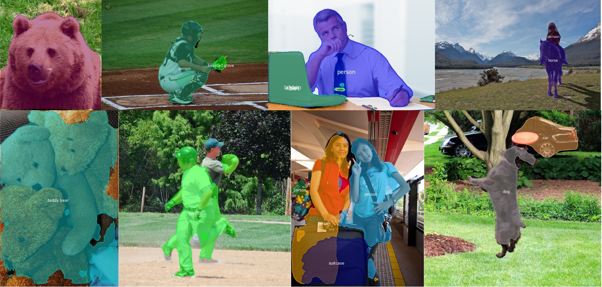

# SOLO
The code is an unofficial pytorch implementation of [SOLO: Segmenting Objects by Locations](https://arxiv.org/abs/1912.04488)

## Install
The code is based on [mmdetection](https://github.com/open-mmlab/mmdetection). Please check [Install.md](https://github.com/open-mmlab/mmdetection/blob/master/docs/INSTALL.md) for installation instructions.

## Training 
Follows the same way as mmdetection.

single GPU: python tools/train.py configs/solo/r50.py

multi GPU (for example 8): ./tools/dist_train.sh configs/solo/r50.py 8 

## Notes

The code only implements the simplest version of SOLO:

* without CoordConv
* using vanilla SOLO instead of Decoupled SOLO
* 3x training schedule
* using the default FPN featuremaps: P3 to P7 which is P2 to P6 in the paper with different specific strides and instance scale selection
* implemented the simplest mask-nms: as the authors did not describe it in detail in the paper, the implemented nms is slow,  will improve it in the future.
* **still in progress**

## Results

Both good and bad results, the images are achieved after training 13 epochs on the coco dataset using the resnet-50 backbone.

